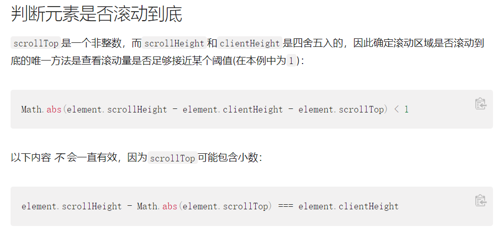
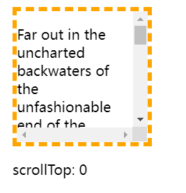
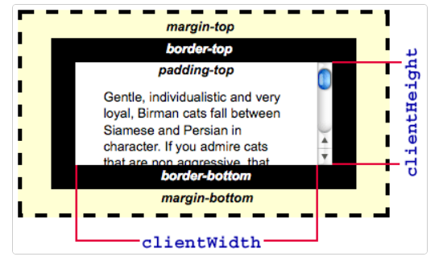

# TJ flea

一个基于 <span style="color: #42D392;">Vue</span> 和 <span style="color: #CA3430;">Express</span> 的经典<span style="text-decoration: line-through">土味</span>的二手交易平台项目<span style="text-decoration: line-through">屎山</span>

## 技术栈

+ 前端：Vue 3 + TypeScript + Pinia + Element Plus + Naive UI
+ 后端：Express + MySQL

## 运行方法

### 后端

后端`/database/db.js`中的数据库配置请根据自己的实际情况修改，目录中提供了数据库的DDL语句。

```
# 进入后端根目录
cd server

# 安装依赖
npm install

# 运行后端
node(nodemon) app.js
```

### 前端

```
# 进入项目根目录
npm install

# 运行前端
npm run dev
```

## 开发所遇问题与解决方案

### Highlights

#### css-doodle 生成图案用作背景

[css-doodle](https://css-doodle.com/)是使用网格容器来生成艺术图案的一个 Web Component，本项目将其用作背景的方案是使用`relative`和`absolute`布局。

#### pinia 和动态路由鉴权

本项目的前端鉴权是通过动态路由(`addRoute`，`removeRoute`)和 Pinia 的全局状态管理实现的。


#### Promise.all() 处理 connection.query

适用于从一张表(通常是外键关系表)获取主码，再从被关系表中取得详细信息的情景（比如从收藏夹中取得商品的 ID 数组，再根据该数组从商品表中取得标题、图片等详细信息），是一个十分实用的 boilerplate。

``` js
// 基本结构
app.get(url, (req, res) => {
    new Promise((resolve) => {
        // query...
        // 取得主键
        resolve(PKs)
    })
    .then((PKs) => {
        const promises = []
        PKs.forEach((PK) => {
            promises.push(
            	new Promise((resolve) => {
                    // query...
                    resolve(Data)
                })
            )
        })
        Promise.all(promises)
        	.then((Datas) => {
            // Datas 存储所有条目的详细信息
            res.end(JSON.stringify(Datas))
        })
    })
})

// 一个例子，获取上架中商品的信息
app.get('/onShelfGoods/:user_id', (req, res) => {
  new Promise((resolve, reject) => {
    connection.query(
      `select * from goodInfo where seller_id='${req.params.user_id}' and available='0'`,
      (err, result) => {
        if (err) throw err
        resolve(JSON.parse(JSON.stringify(result)))
      }
    )
  })
    .then((halfResult) => {
      const promises = []
      halfResult.forEach(item => {
        promises.push(
          new Promise((resolve, reject) => {
            connection.query(
              `select count(*) as cnt1 from collectionBox where good_id='${item.good_id}';
               select count(*) as cnt2 from browseTrack where good_id='${item.good_id}'`,
              (err, result) => {
                if (err) throw err
                let data = JSON.parse(JSON.stringify(result))
                item.likes = JSON.parse(JSON.stringify(data[0]))[0].cnt1
                item.browsed = JSON.parse(JSON.stringify(data[1]))[0].cnt2
                resolve(item)
              }
            )
          })
        )
      })
      Promise.all(promises)
        .then(result => {
          res.end(JSON.stringify(result))
        })
    })
})
```

#### 聊天窗口的滚动条初始化置底

##### 参考资料



+ Element.scrollTop：一个元素的内容垂直滚动的像素数(一个**非整数**)，其值是这个元素的**内容顶部**到其视口可见内容（**的顶部**）的距离的度量。当一个元素的内容没有产生垂直方向的滚动条，那么它的`scrollTop`值为 0。
  + 因为`scrollTop`是三个属性中**唯一一个可写**的，所以要注意其赋值规范：
  + 如果一个元素不能被滚动（例如，它没有溢出，或者这个元素有一个"**non-scrollable"**属性）， `scrollTop`将被设置为`0`。
  + 设置`scrollTop`的值小于0，`scrollTop` 被设为`0`
  + **如果设置了超出这个容器可滚动的值, `scrollTop` 会被设为最大值。**



+ Element.scrollHeight：一个元素的**总高度**（**整数**），包括由于溢出而无法展示在网页的不可见部分。


+ Element.clientHeight：只读属性，是一个**整数**，即元素视口可见内容的高度。



##### 解决方案

+ 在两种情况下，需要操作滚动条到底部：

  + 切换聊天对象时；

  + 未切换聊天对象，但滚动条已经处于底部，且有新消息时。

+ 滚动条置底的方法：

``` js
const el = document.getElementById('...')

// 将元素的 scrollTop 赋值为超出最大值的值(scrollHeight - clientHeight)，则其会转化为可能的最大值，即将滚动条置底，这里使用 scrollHeight 即可。
el.scrollTop = el.scrollHeight
```

+ 如何判断滚动条已在底部？参考上面 MDN 的解答，比较`scrollHeight - (scrollTop + clientHeight)`与一个较小的阈值(考虑到三者的取值特性，通常为 1)。

``` js
if (scrollContainer.scrollHeight - scrollContainer.scrollTop - scrollContainer.clientHeight < 1) {
    // ...
}
```

+ 因为涉及到 DOM 操作，需要使用`nextTick()`保证获取到正确的元素。

``` ts
nextTick(() => {
    const scrollContainer = Array.from(document.getElementsByClassName('n-scrollbar-container'))[1]
    const scrollContent = Array.from(document.getElementsByClassName('n-scrollbar-content'))[1]
    // 令container的scrollTop等于content的scrollHeight
    scrollContainer.scrollTop = scrollContent.scrollHeight
})
```

> Todo: 在此基础上，一个更自动化的设想是对滚动条置底进行监听，检测到置底后便一直置底，直到检测到上滑的操作。

### Bugs

#### 地址栏输入 url 或刷新页面导致 Vue Router 失效

以往对于 Vue Router 的配置都是初始化时就添加所有路由，然后将鉴权的工作交由各组件的生命周期钩子(如 setup, beforeMount, beforeUpdate)或组件内路由守卫(如 beforeRouteUpdate)处理，而由于本项目使用动态路由鉴权，在地址栏导航、浏览器刷新的操作下 Vue Router 会丢失。

这是由于 Vue Router 是专门创建**单页应用程序(SPA)**的，其状态存储于浏览器为该页分配的堆栈中，地址栏导航、浏览器刷新都会导致这些内存被垃圾回收程序**回收**，于是导致 Vue Router 的**丢失**。

为解决该问题，为 Router 添加全局导航守卫`beforeEach`，在守卫中检查 pinia 的 store 中的`identity`(用户身份)字段，根据该字段决定是否需要动态添加用户身份对应的路由，并删除特定路由(如登录)。

``` ts
router.beforeEach((to, from, next) => {
	// initializing store
	const userStore = useUserStore()
	switch (userStore.identity) {
		case 'member':
			if (!router.hasRoute('info')) {
				// 删除登录路由
				loginRoutes.forEach((route) => {
					router.removeRoute(route.name)
				})
				// 添加普通会员路由
				memberRoutes.forEach((route) => {
					router.addRoute(route)
				})
				// 将endRoutes移至尾部
				endRoutes.forEach((route) => {
					router.addRoute(route)
				})
			}
			break
		case 'admin':
			if (!router.hasRoute('report')) {
				// 删除登录路由，添加管理员路由
				loginRoutes.forEach((route) => {
					router.removeRoute(route.name)
				})
				adminRoutes.forEach((route) => {
					router.addRoute(route)
				})
				// 将endRoutes移至尾部
				endRoutes.forEach((route) => {
					router.addRoute(route)
				})          
			}
			break
		case 'visitor':
			break
	}
	next()
})
```

#### 文件上传的请求头设置

在本项目中，存在“上传商品图片”一需求，项目使用 element plus 的 upload 组件，在其提供的`before-upload`钩子中，原本添加了`{'content-type': 'multipart/form-data'}`这一头部，意在说明载荷的类型，但引发后端(express)报错：

```
Error: Multipart: Boundary not found
```

查询后，发现是**重复添加**了上面的头部声明，估计是 el-upload 组件已经封装了该请求头。

#### 为缩略图添加鼠标事件无效

在 Vue 组件中使用`document.querySelector`或者其他捕获 DOM 元素的方法时，捕获范围为**整个页面**，导致一个页面内所有商品媒体对象的缩略图共享一个目前索引(currIndex)。

#### 在 beforeUpdate 中修改引用类型的响应式数据导致组件陷入 update 的无限循环

使用调试钩子`onRenderTracked`和`onRenderTriggered`发现问题，在初始化响应式数据时，原本的写法是：

``` ts
import { ref } from 'vue'
import axios from 'axios'

interface GoodInfo {
	id: string
    title: string
    price: number
  	owner: string
    images: string
    // ...
}

const goodInfo = ref<GoodInfo | null>(null)

axios.post('#')
	.then((res: any) => {
    // 整个修改引用
    goodInfo.value = {
        id: 'Foo',
        title: 'Bar',
        // ...
    }
})
```

上面响应式数据`goodInfo.value`的原始值为`null`，原本已属于引用类型`object`，而在请求到服务端的数据后又直接修改了`goodInfo.value`的引用，这在由响应式数据改变后在`beforeUpdate`中执行的新数据获取，重新遍历对象以绑定响应关系。

这在多组件嵌套的页面，极易引发组件无限 Update，解决方式即避免修改响应式数据的引用（如果其为引用类型的话）。

#### 无 TypeScript 版本的第三方库的类型声明

新建`@/types/module.d.ts`，加入`declare`对第三方模块进行声明，并在`ts.config.json`中添加`"include": ["types/**/*.ts"]`。

#### Pinia 持久化存储

`pinia-plugin-persist`在 [Pure Demo](https://github.com/3fuyang/pure-demo) 中有效，但本项目里却不生效，改为使用`pinia-plugin-persistedstate`。

#### 打包时配置 rollup.js 对包进行 split

在引入了代码以外的文件的情况下，打包得到的一些包的体积会过大，对 vite 进行如下配置，使其对包进行分割：

``` js
export default defineConfig({
    build: {
        rollupOptions: {
            output: {
                // rollup.js分包，控制chunk大小
                manualChunks(id) {
                    if (id.includes('node_modules')) {
                        return id.toString().split('node_modules/')[1].split('/')[0].toString()
                    }
                }
            }
        }
    }
})
```


## 项目架构

```

flea-market // 前端根目录
├─ .git
├─ .gitignore
├─ env.d.ts
├─ index.html
├─ package-lock.json
├─ package.json
├─ public
├─ README.md
├─ server // 后端根目录
│  ├─ app.js  // 入口文件
│  ├─ database  // 数据库连接
│  ├─ flea_now.sql  // DDL
│  ├─ flea_old.sql
│  ├─ package-lock.json
│  ├─ package.json
│  ├─ public  // 图片
│  └─ routes  // 路由
├─ src
│  ├─ App.vue // 应用实例
│  ├─ assets  // 字体、背景图片
│  │  ├─ fonts
│  ├─ components  // 组件
│  ├─ main.ts // 入口
│  ├─ router  // 路由
│  │  └─ index.ts
│  ├─ stores  // 状态管理
│  │  └─ user.ts
│  ├─ types  // 类型定义
│  └─ views // 视图
├─ tsconfig.json
├─ tsconfig.vite-config.json
└─ vite.config.ts // 配置
```
